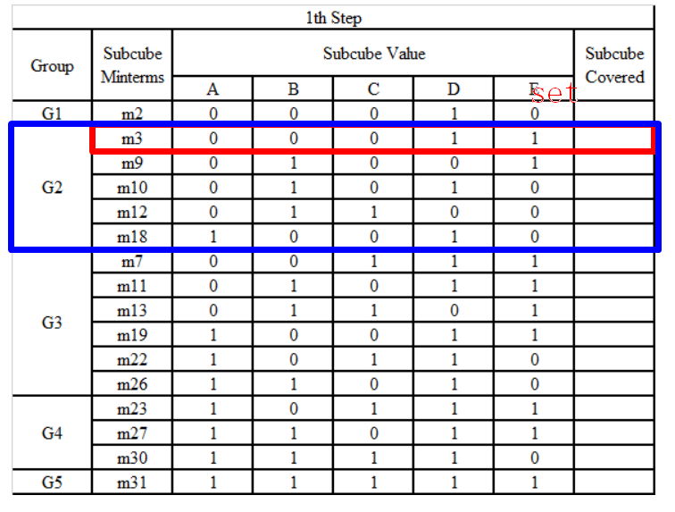

# C++实现用QM算法化简逻辑表达式

## 文件结构
```
bin 二进制文件路径，包括测试程序text.exe
lib 链接库文件
src 源码
    -- logicalExpr.h LogicalExpr类实现
    -- simplify.h Simplified类实现
    -- util.h 工具函数
tests 测试文件源码
CMakeLists.txt CMake编译指令
README.md
```

## 编译环境

在CMake环境下编译，以mingw编译器为例。

``` bash
cd QM
CMake -G "MinGW Makefiles"
mingw32-make
bin\test
```

## 设计说明

类LogicalExpr用于实现真值表到逻辑表达式的转换，不包括化简的过程。

类Simplifid将化简过程在构造函数中实现。核心数据结构是
``` cpp
typedef vector<set<set<int>, util::cmp>> Karnaugh;
```

它表示化简过程中维护的表结构，如下所示。红框和蓝框分别代表一个set容器，它们放入存储整张表的vector容器中。



通过下面这一步可以由QM算法得到可能包含的项，但是它不一定是最简形式，还需要进行select选择素蕴含项。

``` cpp
while (!process.empty())
{
    process = collabrate(i--);
}
```

输入检查放在接口实现中，如果输入的字符串长度不是2的倍数或包含除了0和1以外的项则报错。

``` cpp
std::string truthtable_to_expr(const std::string& truth_table)
{
    int len = truth_table.size();
    while (len > 1)
    {
        len = len / 2;
    }
    if (len == 0)
    {
        cout << "error: invalid truth table" << endl;
        return "";
    }

    for (size_t i = 0; i < truth_table.size(); i++)
    {
        if (truth_table[i] != '0' && truth_table[i] != '1')
        {
            cout << "error: invalid value in the truth table" << endl;
            return "";
        }
    }

    Simplified s(truth_table);
    return s.toString();
}
```
